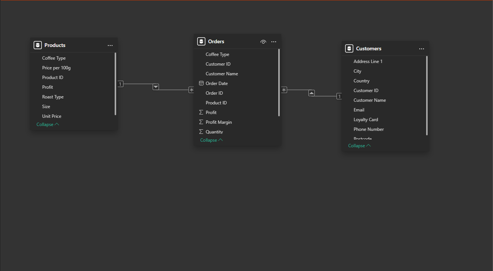
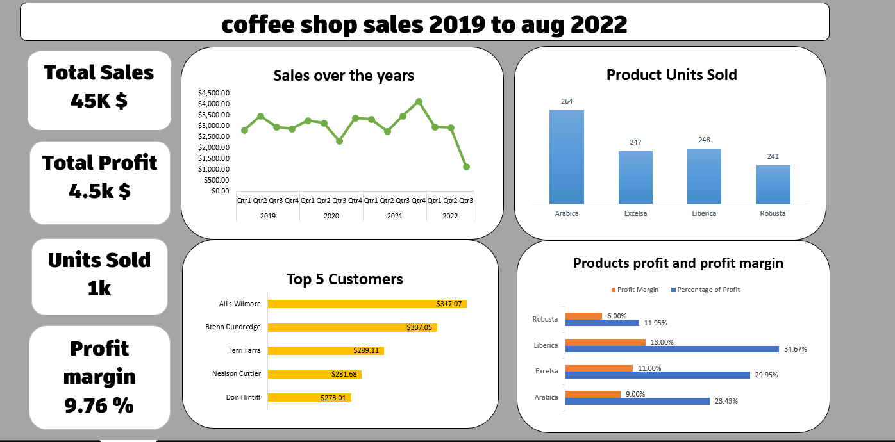

# ☕ Coffee Shop Sales Data Analysis

## 🎯 Project Overview
Comprehensive analysis of coffee shop sales data to extract insights and create reports that support data-driven business decisions aimed at improving performance and profitability.

**Tools Used:** Microsoft Excel, Power Pivot, Pivot Tables, Advanced Excel Functions

## 🔍 Coffee Shop Sales Data Analysis Project

### 🎯 Objective
The goal of this project is to organize, clean, and analyze sales data to extract insights and create reports that support data-driven business decisions aimed at improving performance and profitability.

### 🛠️ Tools & Techniques Used
- **Microsoft Excel:** Data cleaning, modeling, and analysis
- **Power Pivot:** Data modeling and relationships
- **Pivot Tables & Charts:** Insight visualization and reporting
- **Advanced Functions:** XLOOKUP, INDEX + MATCH, TRIM, UPPER, LOWER, TEXT, IFERROR, FLASH FILL

  

### 🧹 Data Cleaning Process
The dataset contained three tables:
- **Orders** - Transaction records
- **Products** - Product information and pricing
- **Customers** - Customer details

#### 1. Removing Duplicates
- Used **Remove Duplicates** and **Conditional Formatting** to identify and delete 9 duplicate rows

#### 2. Handling Missing Values
- Found blanks in OrderDate, PhoneNumber, and Email fields
- Filled missing OrderDate values where OrderID matched but the date was missing

#### 3. Standardizing Data
- **Casing:** Unified text using UPPER() and LOWER() functions
- **Typos:** Corrected via Find & Replace
- **Formatting:** Standardized inconsistent date and number formats
- **Spaces:** Removed unwanted spaces with the TRIM() function
- **Name Formatting:** Used Flash Fill to add spaces between first and last names

### 🔗 Data Modeling
- Created relationships between the three tables using **Power Pivot**
- Added calculated columns to the Orders table for analysis:
  - **Profit** = retrieved using XLOOKUP()
  - **Revenue** = calculated using INDEX + MATCH
  - **Profit Margin** = (Profit / Revenue) × 100
  - **Customer Name** = added via XLOOKUP()

### 📊 Analysis (Pivot Tables & Dashboards)

#### Key Business Questions Addressed:
- 💰 What is the total sales and total profit?
- 🏆 Which products and categories have the highest profit and profit margin?
- 📅 Which year performed best?
- 📈 In which months do sales rise or fall?
- ⚖️ Do higher sales always mean higher profits?
- 👤 Which customer generated the most sales?

### 💡 Key Insights

#### 📈 Business Performance
- The business is **stable and gradually growing**, with minor fluctuations
- **2021 was the best-performing year**; 2020 was the weakest
- **Q3 2021 was the top quarter**, while Q3 2020 was the lowest
- ⚠️ **Note:** Q3 2022 data is incomplete (missing ~20 days from August & September)

#### 👥 Customer Insights
- **Allis Willmore** is the top customer by sales
- Identified key customer segments for targeted marketing

#### ☕ Product Performance
- **Arabica** sold the most units but had **lower profit margins**
- **Liberica** had the **highest profit and profit margin**, followed by **Excelsa**
- Discovered opportunity to optimize product mix for profitability

### 📊 Dashboard Features
- **Interactive sales trends** by year, quarter, and month
- **Product category performance** comparison
- **Customer segmentation** analysis
- **Profitability metrics** with visual indicators
- **Dynamic filtering** by time period and product category
-   

### 🚀 Strategic Recommendations

#### 🔹 Marketing & Sales
- Increase marketing and promotions to boost sales
- Introduce **loyalty programs** for top customers like Allis Willmore
- Develop targeted campaigns for high-value customer segments

#### 🔹 Product Strategy
- Focus on **high-profit products like Liberica** for better margins
- Ensure **Arabica remains well-stocked** as it drives volume
- Consider **product bundling** to increase average transaction value

#### 🔹 Operations & Planning
- Continue **tracking sales trends monthly** to anticipate seasonal changes
- Optimize inventory based on product performance data
- Use insights for staffing and resource planning during peak periods

### 🛠️ Technical Skills Demonstrated

#### Excel Advanced Features:
- **Power Pivot** for data modeling and relationships
- **Advanced Formulas:** XLOOKUP, INDEX+MATCH for data retrieval
- **Data Cleaning:** TRIM, text functions, duplicate removal
- **Pivot Tables & Charts** for dynamic reporting
- **Dashboard Creation** with interactive elements

#### Business Analysis:
- **Profitability Analysis** across product categories
- **Trend Analysis** for seasonal patterns
- **Customer Behavior** insights
- **Data-Driven Decision** support

---

## 📞 Contact
For questions or collaboration opportunities, feel free to connect with me on [LinkedIn](https://www.linkedin.com/in/youssef-gebreal-297a43338/)
